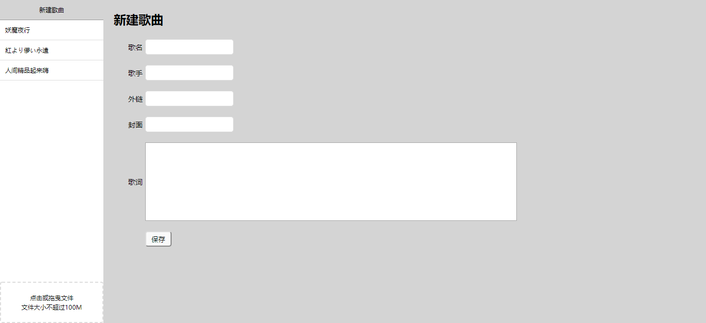
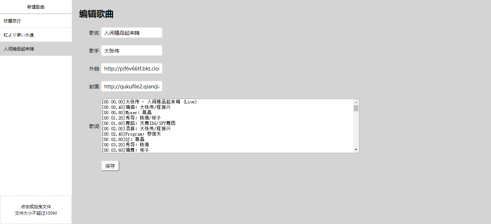
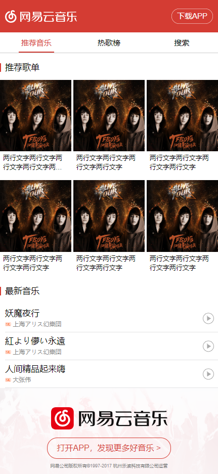
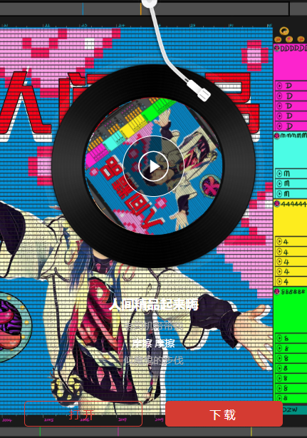

# 仿网易云音乐毕设项目总结
经过几天的课程学习，终于把网易云乐毕设的这几节课学完了。在课程学习的过程中，我跟着课上老师的步骤同时写代码，并试着把每一句代码都去理解清楚。可能这样效果并不好，因为就我现在上传的这个项目而言，基本没有我自己创作的成分在里面，完全是跟着课上老师的操作来的。所以我在这篇总结写完之后，会去自己试着做出一个有自己的特色的播放器，希望这篇总结在让路过的人们了解我这个项目的同时，也能给我自己接下来自己的动手实践带来帮助。

## 总览
当前上传的这个项目是并不完善的项目，正如你所见的，「热歌榜」和「搜索」部分甚至都没做，而且推荐歌单也没有完成。总感觉有点不负责任，不过这个项目也不是一个正式的项目，这只是做这几天网易云音乐毕设课程的一个学习的记录，也是为我接下来自己制作音乐播放器的尝试铺路吧。毕竟跟着做一遍下来多少自己在遇到问题之后心里也有点数，在这里写总结的目的也是如此。下面是我大致地列出来的这个项目现在实现了哪些功能：

1. 后台有上传歌曲、编辑歌曲功能。
2. 后台支持歌单创建。
3. 前端页面灵感来自网易云音乐。
4. 可在线听歌、查看歌词。且配有播放动画。

在项目制作中主要用到了以下技术：

* 后台：LeanCloud 数据存储 API、七牛上传接口
* 前端：原生 JS、jQuery、CSS 3、iconfont、SVG、AJAX、MVC

预览链接在github上面的项目描述里已经给出来了，点进去之后就是这个音乐播放器的主页：[http://franko.top/music-demo/src/index.html](http://franko.top/music-demo/src/index.html)。我们的主页与后台界面并没有关联，后台界面按说是应该需要设置验证身份，注册登录后才可以进行操作的，这里也没有弄。后台界面的链接如下：[http://franko.top/music-demo/src/index.html](http://franko.top/music-demo/src/index.html)。这次的后台界面做得很粗糙，因为是课上的效果，所以要求只是实现最基本的功能而已。关于后台的歌单创建。虽然现在往数据库添加歌单的界面也做了，而且也确实可以添加，但是这个功能也就仅限于此，我也并没有把歌单与歌曲关联起来。这一方面就涉及到我还没有做的歌单推荐部分了。

关于这个项目整个的界面的样式，我们可以看出来这确实完全是仿照网易云音乐移动端的界面来做的，是使用flex布局完成的。因为只为移动端设计了页面，所以用pc浏览器需要将浏览器宽度调小才能展示为正常效果。页面样式在有些地方还存在瑕疵，比如歌单界面的背景图片没有设置模糊，在界面样式这一方面还有很大的提高空间。实际上这整个样式这部分其实也是抄袭了课上的代码，在课上为了剩下写样式的时间，直接把整段代码直接拷过来用了。所以关于样式的部分，因为没有自己动手做的缘故，确实没有积累到什么经验。也正是因为这个项目并不是我的正式项目，所以如果我没有多余的时间的话，我可能不会对我当前的效果再做进一步的优化了。

所以这篇总结我能用来拿出来编排的只有两个部分，后台上传功能与在线听歌功能了。这两个功能基本已经实现了，因此本文就将通过对这两个模块进行分析，来帮助大家了解这个项目的来龙去脉。

## 歌曲上传功能
歌曲上传功能是这个毕设项目最早开始着手实现的一部分，歌曲上传是在后台管理界面完成的。后台管理界面中有一下几个模块，新建歌曲、编辑歌曲与上传歌曲。下面是整个后台界面的样式：<div align=center></div>

在这个后台管理界面中，我们可以上传歌曲到音乐播放器中进行播放。首先我们需要上传音乐文件到七牛云的存储空间中，因为我们需要获取歌曲存储到七牛云之后生成的外链，这样我们在前台就可以借由将这个外链添加到audio标签中来实现歌曲的播放。

如果我们已经拥有一首歌曲的外链，我们可以直接点击新建歌曲，将歌曲的外链url填写在「外链」项中。在新建歌曲模块，我们还可以对歌曲的歌名、歌手、歌曲封面及歌词进行编辑。这些信息都可以在信息保存后在音乐播放器中展现出来。

如果我们并没有歌曲的外链，我们就需要先将歌曲上传至七牛云以获得外链。在页面的左下角就是歌曲上传模块，后台管理员可以在这里将歌曲文件选择上传或将文件拖曳至此区域进行上传。整个上传区域以及上传文件的功能都是使用七牛云的上传接口，在这里上传的文件能够直接存入七牛云的存储空间，目前并没有对文件类型进行过滤的功能。

使用这个歌曲上传模块上传文件时，服务器会查询请求中是否包含uptoken字段，而这个uptoken需要打开后台服务才能够获取。因此我们在放在github中的这个后台管理界面会因为请求中没有uptoken字段导致无法上传，这也是为了七牛云的存储安全考虑的。

因此，这也限制了目前之后这个项目的管理人员才能够往音乐播放器中添加歌曲。除了在后台界面添加歌曲，直接到七牛云的管理界面中上传音乐文件也是可以的，只要获得了这个歌曲相应的外链就行。

如果我们是使用后台管理界面上传歌曲，上传成功之后就会直接跳转到新建歌曲界面，并且刚才上传的歌曲的外链与歌曲名会直接显示在表单里。然后我们就可以对这首歌个歌曲信息进行完善。<div align=center></div>

歌曲信息我们是以LeanCloud作为数据库来存储的。点击保存后歌曲信息就会保存到LeanCloud中。保存成功之后，新添加的歌曲信息会被立即展示在后台界面的左侧边栏中，我们可以点击边栏中的歌曲进入编辑歌曲状态，对数据库中已有的歌曲信息进行编辑。这些数据库相关的操作都是依赖LeanCloud 的数据存储 API进行的。

整个后台管理界面的功能大致如此，我将整个页面划分了五个模块来分别实现这些功能，期中有新建歌曲（new-song.js）、歌曲表单（song-form.js）、歌曲列表（song-list.js）、歌曲上传（upload-song.js）以及加载动画（loading.js）。每个模块的设计都使用了MVC模式，页面渲染由view模块负责、数据处理由model负责、模块逻辑由controller负责。

每个模块之间的交互都是使用发布-订阅模式。比如新建歌曲时，在歌曲表单模块监听表单的提交事件，并发布「歌曲创建」事件，然后歌曲列表模块设定则监听这个事件，一旦监听到了就立即重新渲染歌曲列表模块，以实现歌曲列表的事实更新。除此之外还有「新建歌曲」、「更新歌曲」、「选择歌曲」等事件，每当相应的事件发生时，各个模块都可以监听到时间的发生，去执行相应的事件。这就是这个模块的大致实现思路。

## 在线听歌功能
下面是我们的前台的音乐播放界面，整个界面都是仿照网易云音乐设计的。音乐播放界面并不完善，到目前为止并没有给这个播放平台加上专辑、榜单、搜索等功能，只能够在下方的「最新音乐」列表中选择歌曲，点击播放按钮就可以进入相应的歌曲播放界面，如下图所示：<div align=center></div>

这个模块的实现也比较简单，首先从我们之前存放歌曲信息的LeanCloud数据库中读取所有歌曲信息，再为歌曲信息比如歌曲名、歌手名分别创建一个p标签，然后再对所有歌曲信息进行遍历，最后将所有p标签添加到页面当中。右侧的播放键则是一个a标签，a标签中的跳转链接则以歌曲的id作为查询参数，这样就能点击跳转到相应的歌曲播放界面了。

这里我上传了几首歌曲，其中一首是有歌词的，点击唱片中心播放键之后歌曲就会开始播放，而且唱片也会开始转动。除此之外，歌词也会随着歌曲的播放时间而展示相应的歌词。等到歌曲播放结束后，唱片也随之停止转动。效果如下图：<div align=center></div>

歌曲播放界面的样式也是我照搬老师之前做的布局，这个唱片大致由几张图片经过绝对定位组合而成，其中包括唱片上的针、唱片的碟片、碟片的高光以及歌曲图片。页面的背景其实也是歌单的图片，本来需要再加个模糊处理，但是这里并没有实现。点击播放键则会触发「歌曲播放」事件，事件会调用audio标签的play方法使歌曲播放，并给整个碟片div添加playing属性，使得事先用CSS写好的转动动画开始播放；点击暂停键则会触发「歌曲暂停」事件，调用audio的pause方法使歌曲暂停，并且移除碟片div的playing属性。同时监听audio标签的ended事件，使得在歌曲播放结束自动触发歌曲暂停」事件，这样就实现了歌曲播放结束同时碟片停止转动。

接下来就是比较炫酷的歌词播放功能，让歌词能够随着播放时间播放咋一听感觉比较难以实现，但是了解原理之后就会感觉也不是那么深奥。首先我们在编辑歌曲时上传的歌词内容时是要符合lrc格式的，就是每一句歌词签都要加上相应的播放时间。进入歌曲播放页面后我们通过查询参数获取到当前歌曲的id，然后借助这个id获取到整个歌曲信息。拿到每行歌词后我们先使用正则对其进行解析，解析方法大致如下：

``` javascript
let regex = /\[([\d:.]+)\](.+)/
let matches = string.match(regex)//使用正则分析字符串
```
经过分析后我们就可以把每行歌词的时间部分与歌词部分分开，遍历所有歌词，然后将每句歌词都填入一个创建好的p标签，将时间作为该标签的一个属性。然后将所有p标签填充至页面中的歌词展示区域。这样我们就可以在页面中看到一句句不含时间内容的歌词了。

然后就是比较重要的歌词滚动功能。我们首先要监听audio的timeupdate事件，每当歌曲播放时间改变时，这个事件就会触发，通过audio的currentTime属性我们则可以获取当前歌曲已经播放的秒数，所以我们刚才存入p标签的时间属性也应该是秒数时间。获取到时间之后我们再遍历所有p标签，如果当前时间大于前一个p标签中时间且小于后一个p标签中的时间，我们就应该展示前一个p标签。

我们使用标签的Element.getBoundingClientRect().top属性来获取当前p标签的距页面顶部的高度h1，然后再获取到歌词展示框距顶部的高度h2，然后获得歌词内容需要往上移动的距离height=h1-h2，然后通过改变歌词内容的transform属性就可以实现歌词的移动了。因为每当timeupdate事件触发我们就会执行一次p标签的遍历与滚动。歌曲播放到最后一句歌词后就不再进行遍历，直接展示最后一句歌词。这样就实现了歌词动态展示的效果了。

整个音乐播放器我也是使用了MVC的设计思想来设计模块，总共设计了导航栏（tab.js）、首页（page-1.js）、推荐歌单（page-1-1.js）、最新歌曲（page-1-2.js)、热歌榜（page-2.js）、搜索（page-3.js）、歌曲播放（app.js）这几个模块，因为很多模块都没有完善，所以模块间的交互并不频繁。值得一提的是，推荐歌单（page-1-1.js）与最新歌曲（page-1-2.js)两部分作为首页的两个部分，是由首页（page-1.js）通过写入script标签引入的，这样就实现了在一个js文件中再划分两个模块的效果。

## 总结
这次的毕设项目实现的效果大致就是如此了。在实现过程中我们用到了许多之前学过的技术，比如获取p标签的高度这里，我们使用的是原生js，此外大部分涉及到DOM的操作我们都是使用jQuery完成的；页面的样式完全使用到了CSS 3，比如碟片的转动等。页面中的许多icon图片都是使用了iconfont的SVG图标；为了实现后台上传功能，我们自己开启了服务器获取uptoken，这里则用到了AJAx；整个项目的模块都是使用MVC设计模式来设计的，此外我们使用了发布-订阅模式实现模块间的交互。

总而言之，通过这次毕设的学习，我也算是自己动手实现了一个比较拿得出手的小项目，尽管很多地方还不完善。因此我会在接下来自己去试着重新制作一个更加完美的在线音乐播放器，这次的总结就算是一个预热吧。待会我就会在我的本地删除这个项目，从头再借助这个思路做一遍。

本文在我的博客中的地址：http://franko.top/1811/20181128A/